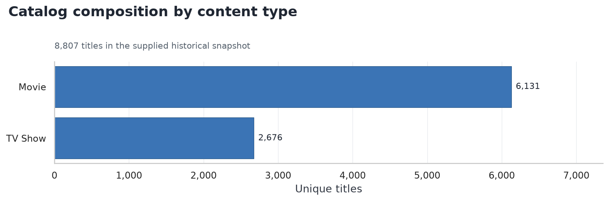
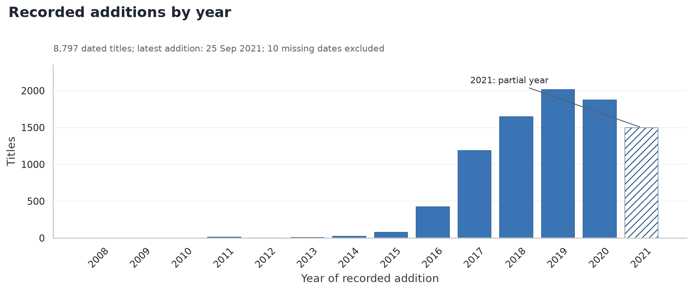
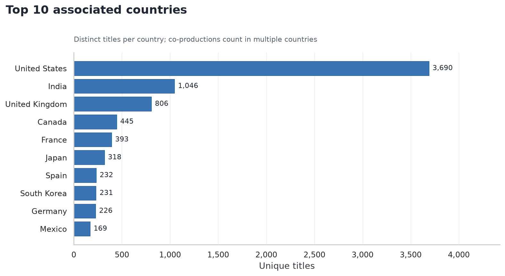
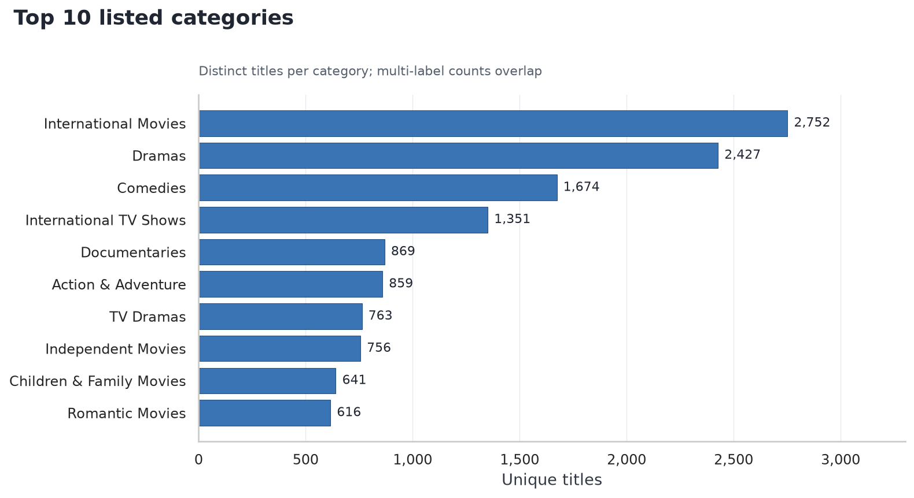
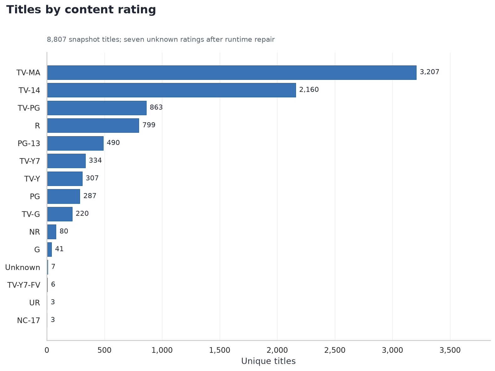
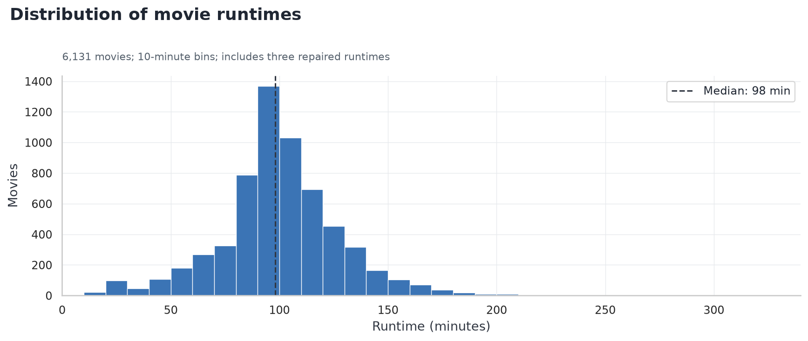

# Netflix Catalog Analysis

**An exploratory study of 8,807 movies and TV shows using Python and Pandas.**

This project turns raw catalog metadata into clean title-level and relationship
tables, then examines content mix, recorded additions, countries, listed categories,
ratings, contributors, and duration. The emphasis is on reproducible analysis and
clear interpretation of what the data can support.

**[Explore the notebook](notebooks/Netflix_EDA.ipynb)** ·
**[View the dataset](data/netflix.csv)** · **[Run locally](#run-locally)**

> **Scope:** A historical snapshot with recorded addition dates through September
> 25, 2021. This is not Netflix's current catalog. The dataset contains no viewership,
> revenue, subscriber, or licensing-cost measures.

## Key findings

| Question | Verified result |
|---|---|
| What is the content mix? | **6,131 movies (69.6%)** and **2,676 TV shows (30.4%)**. |
| Which year has the most recorded additions? | **2019: 2,016 titles**. The 2021 period is incomplete; 10 undated titles are excluded. |
| Which country has the most associated titles? | **United States: 3,690**, followed by **India: 1,046**. Co-productions count in multiple countries. |
| Which listed category is largest? | **International Movies: 2,752 titles**, followed by **Dramas: 2,427**. Category counts overlap. |
| Which content rating is most common? | **TV-MA: 3,207 titles**. Ratings classify content; they are not viewer scores. |
| What do duration fields show? | **98-minute median movie runtime**; **1,793 TV shows (67.0%)** have one recorded season. |

## Selected visualizations

### Content mix

Movies account for roughly seven in ten titles in the supplied snapshot.



### Recorded additions over time

The largest annual count is in 2019. These are addition dates among titles present
in this dataset; without removal history, they do not measure net catalog growth.
The hatched 2021 bar represents a partial year.



### Countries and listed categories

Each chart counts distinct titles associated with a label. A title may contribute
to several countries or categories, so the bars are not mutually exclusive.
Country metadata describes title associations, not viewer location or streaming availability.





### Ratings and runtime

TV-MA is the largest content-rating group. The movie runtime distribution has a
98-minute median; unusual runtimes are retained and inspected in the notebook.





## Methods and data quality

- **Audit:** inspect 8,807 rows and 12 source columns, verify unique `show_id`
  values, and summarize missingness.
- **Clean:** work on a copy, trim whitespace, label missing descriptive metadata
  `Unknown`, and retain missing dates as `NaT`.
- **Repair:** transfer three misplaced `74 min`, `84 min`, and `66 min` values
  from `rating` into the corresponding missing movie durations. Their ratings
  become `Unknown`. The source CSV remains unchanged.
- **Normalize relationships:** split and explode director, cast, country, and
  category lists; remove blank/unknown tokens and duplicate title–attribute pairs.
  Keep the title table separate to avoid inflated counts from overlapping joins.
- **Engineer features:** derive addition year/month, movie runtime in minutes,
  TV season count, and a year-based content-age estimate.
- **Explore:** compare distributions, time patterns, content-type segments,
  country–category relationships, and potential runtime outliers.
- **Validate:** check title grain, relationship keys, join coverage, date totals,
  percentage denominators, and separation of movie minutes from TV seasons.

### Interpretation limits

The raw file has 2,634 missing directors, 825 missing cast entries, and 831 missing
country entries. Rankings exclude unknowns and may reflect uneven metadata
coverage. Ten missing addition dates are excluded from time analyses. Fourteen
negative addition-year minus release-year differences are retained for audit and
excluded from age summaries.

The 2021 window ends in September, and pooled month totals have unequal coverage.
Neither supports an unqualified slowdown or seasonality claim. A one-season TV
show entry does not establish cancellation, completion, or Netflix exclusivity.

## Business implications

Use this analysis as a catalog inventory baseline. The content mix and the
country/category rankings suggest segments to examine further. Assessing a
content-investment opportunity requires market-specific availability, engagement,
retention, and licensing costs. Catalog counts alone cannot establish demand or
profitability. Compare complete periods and obtain removal history before
evaluating catalog growth.

## Repository structure

```text
Netflix-Data-Analysis/
├── README.md
├── AGENTS.md
├── requirements.txt
├── .gitignore
├── data/
│   └── netflix.csv
├── notebooks/
│   └── Netflix_EDA.ipynb
└── images/
    ├── content_type_distribution.png
    ├── recorded_additions_by_year.png
    ├── top_10_countries.png
    ├── top_10_genres.png
    ├── content_ratings.png
    └── movie_duration_distribution.png
```

## Run locally

Use **Python 3.12**. Direct dependencies in `requirements.txt` are pinned to the
versions used for verification.

```bash
git clone https://github.com/Gokulprasanth26/Netflix-Data-Analysis.git
cd Netflix-Data-Analysis
python -m venv .venv
```

Activate the environment:

```powershell
# Windows PowerShell
.venv\Scripts\Activate.ps1
```

```bash
# macOS / Linux
source .venv/bin/activate
```

Install dependencies and open JupyterLab:

```bash
python -m pip install -r requirements.txt
python -m jupyterlab
```

Open `notebooks/Netflix_EDA.ipynb` and select **Restart Kernel and Run All Cells**.
The notebook reads the included CSV and regenerates all six figures in `images/`;
it does not need to download the data.

For command-line execution from the repository root:

```bash
python -m nbconvert --execute --to notebook --inplace notebooks/Netflix_EDA.ipynb --ExecutePreprocessor.timeout=120
```

## Data provenance

The included CSV is preserved byte-for-byte from this repository's original
dataset at commit [`5e4a68f`](https://github.com/Gokulprasanth26/Netflix-Data-Analysis/tree/5e4a68f).
The upstream publisher, collection method, and redistribution license were not
documented in the original repository; no upstream attribution or license is assumed.

## Skills demonstrated

Python · Pandas · NumPy · Data cleaning · Relationship-table modeling ·
Exploratory data analysis · Matplotlib · Seaborn · Data validation ·
Communicating analytical limitations

**Author:** [Gokul Prasanth](https://github.com/Gokulprasanth26)
